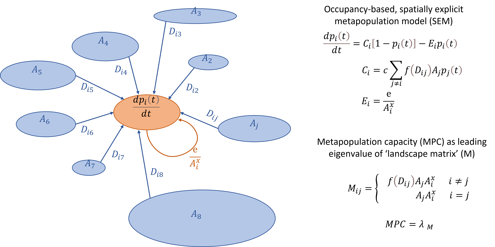

```{r setup, include=FALSE}
knitr::opts_chunk$set(echo = TRUE)
```

Methods Report

# Summary
***

The metapopulation capacity (MPC, Figure 1) is a measure rooted in metapopulation theory (10–12) and integrates the effects of habitat amount and configuration on species' metapopulation dynamics, which are governed by extinction from and colonization of habitat by local populations. MPC allows the estimation of the potential metapopulation persistence and extinction risk in a landscape (3,13) and can be derived from relatively simple habitat distribution maps. Therefore, MPC has a high potential for the application as indicator in ecological connectivity analyses for conservation management across contexts and spatial scales (10). 

This report contains an in-depth explanation of the MPC measure, it's background, basic model formulation and parameter interpretation, as well as descriptions of MPC's value range, an introduction to MPC-related indices and potential ways to integrate MPC across multiple species. 

These descriptions aim at supporting the species- and data specific tailoring and implementation of MPC-based connectivity analyses by conservation practitioners.


```{r figure, echo=FALSE, fig.cap="", out.width = '100%'}

```


**Figure 1. Metapopulation capacity (MPC) modeling overview.** The MPC is based on a spatially explicit metapopulation model (SEM, (2,10)) of local populations’ presence or absence at different habitat patches and timepoints. The  rate  of  change  in  the  probability of patch $i$ being occupied ($\frac{dp_i(t)}{dt}$) is dependent on the colonization and extinction probabilities $C_i$ and $E_i$, respectively. Whereas the extinction probability $E_i$ is mainly dependent on the area of patch $i$ ($A_i$) and two parameters $e$ and $x$; the colonization probability $C_i$ is the sum of probabilities of occupancy of - and successful dispersal from - all surrounding habitat patches $j$, in dependence of the dispersal survival probability [$f(D_{ij})$, dependent on the distance between patches $j$ and $i$ ($D_{ij}$)], the areas of patches $j$ ($A_j$, implying more emigrants with larger area), and a colonization parameter $c$. MPC is calculated as the dominant eigenvalue of a matrix notation of the SEM, which is quite a common technique to model long term growth rates in population projection matrices (PPMs, (15)). In the square SEM matrix (rows and columns reflect patches 1-$i$ and 1-$j$, respectively), each cell $M_{ij}$ consists of the product of the rate of colonization from patch $j$ and the inverse of the extinction rate in patch $i$ ((3), note that parameters $e$ and $c$ are excluded). The dominant eigenvalue of this matrix, which is the single greatest, positive eigenvalue (and which is also the simple root of the characteristic polynomial of the matrix) describes the long-term (asymptotic) rate of change in the probability of patch-occupancy in the metapopulation independent of parameters $c$ and $e$. Therefore, it can be interpreted as ‘effective metapopulation size’ (2) or the metapopulation (carrying) capacity of the landscape (10,14).


# Background {.tabset .tabset-fade .tabset-pills}
***

Facilitating ecological connectivity in the world’s increasingly fragmented landscapes is crucial for effective biodiversity conservation management and requires adequate measurement by indicators that ideally capture species’ persistence or extinction risk (e.g. (1–3)). 

There exists a wealth of ecological connectivity indicators that vary across a spectrum from structural connectivity (species-unspecific, focused on spatial structure and physical connectedness of habitat) to functional connectivity (focused on species-specific movement, habitat suitability, and connectedness (4–9)). Structural connectivity indicators tend to be relatively simple to calculate and readily applicable across large spatial extents, but their biological interpretation is often not straightforward (2). On the other hand, functional connectivity indicators often offer a biologically meaningful interpretation, but tend to involve more complex calculations and data that is not always available (2). 

The metapopulation capacity indicator (MPC) proposed by (10) is based on the measurement of functional connectivity and provides both, a straightforward biological interpretation and relatively simple calculation algorithm (2). In short, MPC is calculated as the leading eigenvalue of a ‘landscape matrix’ constructed from a set of habitat patches with known areas and interpatch distances, multiplied by species-specific colonization and extinction rates (Figure 1). Specifically, in the MPC framework, local populations can either be present or absent at different habitat patches and timepoints, depending on the two opposing forces extinction rate and colonization rate that are in turn governed by patch areas and distances (3). MPC is a unitless metric that is analogous to ‘effective metapopulation size’ (2), and can be interpreted as the metapopulation (carrying) capacity of the landscape (Figure 1, (10,14)). For any given landscape, a minimum threshold value of MPC for species persistence can be calculated based on species extinction and colonization rates, and therefore, MPC can be used to rank landscapes in their extinction risk or vice-versa, their capability to sustain viable metapopulations of any species (10). Additionally, for any landscape, the eigenvector associated with the MPC can be used to assess  the contribution of each habitat patch to the MPC value and therefore, to assess the importance of each habitat patch for landscape-level connectivity (10).


# Basic Concept {.tabset .tabset-fade .tabset-pills}
***

The MPC proposed by (10) is derived from an occupancy-based, spatially explicit metapopulation model (SEM) modified from (12) that links the metapopulation processes of colonization and extinction to landscape patch areas and their spatial locations (2,10). The model is constructed as a generalized incidence function, where species patch occupancy is described by a linear, first-order Markov chain with two states (occupied vs. not occupied patches, (11)). In this model, the rate of change in the probability of a patch of the habitat patch network being occupied depends on the species-specific colonization ($C_i$) and extinction ($E_i$) rates as follows:
\begin{equation}
\tag{1}
\frac{dp_i(t)}{dt}=(C_i)[1-p_i(t)]-(E_i)p_i(t)		
\end{equation}
,where $\frac{dp_i(t)}{dt}$ is the change in population in patch $i$ over time and $p_i$ is the occupancy rate of patch $i$.

These colonization and extinction rates are not restricted to any particular functional forms in detail (10), but for example, they can be expressed in general and biologically justified formulas as follows (cf. (2), see further below for explanations and examples of constants and functions): 

\begin{equation}
\tag{2}
C_i=c\sum_{i\neq j}{f(D_{ij})A_jp_j(t)}
\end{equation}
\begin{equation}
\tag{3}
E_i=\frac{e}{{A_i}^x}
\end{equation}
, where $c$, $e$ and $x$ are constants, $A_i$ and $A_j$ are the areas of patches $i$ and $j$, respectively, $f(D_{ij})$ is the dispersal survival function dependent on the distance between patches $i$ and $j$, and $p_j$ is the occupancy rate of patch $j$ (indicating the proportion of individuals leaving patch $j$ that successfully reach patch $i$ at distance $D_{ij}$ away (16)). With these formulations, the colonization rate $C_i$ reflects the sum of the incoming rates from all other occupied patches in the patch network, whereas the extinction rate $E_i$ is a function of local habitat patch area. 

**It is important to note that this model entirely focuses on the patch occupancy (i.e. presence or absence of a species in habitat patches) at relatively coarse temporal resolution (e.g. yearly time intervals (11)) and ignores local population dynamics**, such as changes in local population sizes, because they are assumed to occur fast in comparison with longer-term metapopulation dynamics such as the colonization of and extinction of species populations from habitat patches (11).

To calculate MPC, Hanski and Ovaskainen (10) express the system of equations reflecting  the likelihood of patch occupancy for all patches in the habitat network (eq. 1 above) independently of  $c$ and $e$ (eqs. 2 & 3) using matrix notation as follows (2):
\begin{equation}
\tag{4}
m_{ij}=f(D_{ij})A_j{A_i}^x\:for\:i\neq j,\:and\:m_{ij}=0\:for\:i=j
\end{equation}
, where $m_{ij}$ are elements of the matrix $M$ that reflect the rates of change for the occupancy of patches $i$ ($p_i$) based on the product of the colonization rate $C_i$ with the inverse of the extinction rate $E_i$ (3).

**Importantly, the notation $m_{ij}=0$  for  $i=j$ implies that ‘self-colonization’ of a patch is not possible.** While being meaningful for cases where colonization is defined as ‘between-patch movement’ at small scales in highly fragmented landscapes, this assumption is unlikely to hold true in real-world conservation contexts at larger spatial scales, where large contiguous habitat patches are likely to provide colonists for a recolonization within the same patch. Therefore, to account for a ‘patchs’ own rescue effect’, and appropriately account for the importance of large patches, Schnell (2) defined ‘colonization’ more broadly as ‘process that refills patches’ & modified the original formulation as follows:

\begin{equation}
\tag{5}
m_{ij}=f(D_{ij})A_j{A_i}^x\:for\:i\neq j,\:and\:m_{ij}=A_j{A_i}^x\:for\:i=j
\end{equation}

**The MPC is then calculated as the leading eigenvalue of this matrix $M$ ($\lambda M$; (10))**, which is the greatest, positive eigenvalue (as well as the simple root of the characteristic polynomial) of the matrix: 
\begin{equation}
\tag{6}
MPC=\lambda_M
\end{equation}

Dominant eigenvalues are commonly used to assess long term growth rates in population projection matrices (PPMs, (15)). In this case, $\lambda_M$ describes the long-term (asymptotic) rate of change in the probability of patch-occupancy in the metapopulation independent of parameters $c$ and $e$. 
In the spatially implicit Levin’s model (12), an equilibrium fraction of occupied patches ($p^*$), is determined by the fraction of suitable habitat patches ($h$) and the ratio of extinction ($e$) and colonization ($c$) rate parameters ($\delta=\frac{e}{c}$) as follows:
\begin{equation}
\tag{7}
p^*=1-\frac{\delta}{h}			 
\end{equation}

Similarly, (10) show that an appropriately (i.e. leading-eigenvector-) weighted **average fraction of occupied patches in the landscape ($p^*$) can be approximated** for the spatially explicit metapopulation model as follows: 
\begin{equation}
\tag{8}
p_{\lambda}^*=1-\frac{\delta}{\lambda_M}			 
\end{equation}

The authors in (10) highlight the structural identity of eqs. 7 and 8, and explain the functional interpretation of $\lambda_M$ as the effective ‘amount of suitable habitat’ available to a metapopulation, an ‘effective metapopulation size’ reflecting the number of patches in a Levins-type (i.e. nonspatial) metapopulation (2) or in other words, the metapopulation (carrying) capacity of the landscape (10,14). From eq. 8 it can also be derived that an equilibrium solution $p^* > 0$ only exists if: 
follows: 
\begin{equation}
\tag{9}
\lambda_M > \delta
\end{equation}

**Hence, MPC ($\lambda_M$) is directly relatable to the minimum threshold of metapopulation persistence ($\delta$) and can be used to approximate persistence probability for any given species in any given landscape.** $\lambda_M$ is a useful indicator of landscape quality with regard to species persistence, especially if the colonization and extinction rate constants ($c$ and $e$) are not known, which is the case in many applied conservation contexts, (2,10). 

**Importantly, $\lambda_M$ strongly depends on the total habitat area and can vary by several orders of magnitude between landscapes and species of interest (16).** Several methods to standardize $\lambda_M$ exist (cf. ‘Related indices’ section).


# Parameterization {.tabset .tabset-fade .tabset-pills}
***

The MPC can be calculated for any given landscape with defined habitat patch areas, interpatch distances and functions characterizing colonization and extinction rates. **Species-specific information can be incorporated in the formulation of colonization and extinction rate functions** that are often expressed as functions of habitat patch areas, distances and species-specific movement (e.g. dispersal capacity). **Besides that, species-specific information is already implicitly included in the preceding step when habitat patches are defined** for a given landscape.

## Colonization rate ($C_i$) parameters

The colonization rate $C_i$ depends on the dispersal survival probability $f(D_{ij})$ (and hence, the distance $D_{ij}$) between all surrounding patches $j$ and the focal patch $i$; a species-specific dispersal capacity ($\alpha$), a colonization parameter $c$ and the areas of patches $j$ ($A_j$).

### Dispersal survival function $f(D_{ij})$

The most commonly used dispersal survival functions $f(D_{ij})$ needed to calculate colonization rate ($C_i$, eq. 1) are the following:

#### exponential distance decay 
(e.g. (10,16), $\alpha$ is usually the average dispersal distance)
$$
f(D_{ij})=exp(-\frac{1}{\alpha}D_{ij})
$$

#### linear distance decay 
(e.g. (16), $\alpha$ is usually the maximum dispersal distance)
$$
f(D_{ij})=1-\frac{D_{ij}}{\alpha}\:for\:D_{ij}<\alpha\:and\:f(D_{ij})=0\:for\:D_{ij}\ge\alpha
$$

#### log-sech distribution distance decay
(e.g. (2,3,17), $\alpha$ is usually the average dispersal distance)
$$
f(D_{ij})=\frac{2arctan[(\alpha/D_{ij})^{1/(\frac{1}{\beta-1})}]}{\pi}\:for\:D_{ij}\ge0
$$
,where $D_{ij}$ is the distance between patches $i$ and $j$, $\alpha$ is the species-specific dispersal distance (e.g. average or maximum dispersal distance) and $\beta$ the distribution tail-thickness parameter.

### Interpatch distance ($D_{ij}$)
Most commonly, interpatch distance ($D_{ij}$) is calculated as euclidean, nearest ‘edge-to-edge’ pairwise distances between all habitat patches (e.g. (2,3,16)). However, other biologically meaningful distance measurements could be used instead (11), such as distance measures based on landscape suitability/resistance and different types of species movement (e.g. least-cost distances (18–20), (constrained) random walks (21), conductance based on circuit theory (22), network flow (23) or other metrics based on graph theory (24)). 

### Dispersal distance ($\alpha$)
The value and unit of the species-specific dispersal distance ($\alpha$) is dependent on the way interpatch distance ($D_{ij}$) is defined. Commonly, it is specified as the average or maximal dispersal distance of a species in meters (e.g. (2,3,16)). Depending on the species, the taxonomic group, and/or the type of dispersal of interest (e.g. gap-crossing, home-range, breeding or natal dispersal (25,26)) $\alpha$ can vary substantially from a few meters to dozens of kilometers and can be derived from direct observations (e.g. mark-recapture studies, (25)) or allometric body-size relationships (e.g. (16,27)). Common values used for average dispersal for a wide range of terrestrial animals lie between 100m and 1000m (16,25,26). For example, refs. (2) and (3) used the average dispersal distance $\alpha$=317m and the log-sech dispersal survival function with coefficient $\beta$=1.77, which was found to best fit across a variety of bird species in fragmented forests (17).

### Colonization parameter ($c$)
The colonization parameter c denotes the rate at which colonists leave a patch per unit of area (in most cases $m^2$, $ha$ or $km^2$) per unit time (in most cases 1 year) in the direction of every oher patch in the habitat network (2). Values can be estimated using observational data (e.g. (14)). Values that have been used in studies of North American forests are $c$=0.0012 colonizing individuals per 100 $km^2$ (2).


## Extinction rate ($E_i$) parameters
Since expected population sizes increase proportionally with habitat area, and because extinction probability decreases with population size (cf. (10,11) and references therein), extinction rate is modeled as a function of habitat patch area with two constants, $e$ and $x$ ($E_i=\frac{e}{{A_i}^x}$, eq. 3). Hence, $E_i$ equals 1 for any $A_i\le e^{\frac{1}{x}}$, the latter of which therefore giving the critical patch area, for which a local population has a unit probability of extinction per unit time.

### Stochasticity ($x$)
The parameter $x$ is inversely related to the severity of environmental stochasticity and the dependence of extinction rate on patch size alone. Specifically, when $x$ is large (>1), it becomes very unlikely for populations to go extinct after a critical patch size has been reached. If $x$ is small (<1), there exists no critical patch size and populations can even go extinct if they are large (11). For many taxa, a value of $x=0.5$ has been found appropriate (e.g. (2,3,16)). 

### Extinction parameter ($e$)
The extinction parameter $e$ denotes the rate of extinction per unit of area (in most cases $m^2$, $ha$ or $km^2$) per unit time (in most cases 1 year). A study of tropical understory bird species suggests a value of $e=0.07$ (28), and studies of butterfly metapopulations 0.01-0.44 ($ha$, (11)) 

### Extinction threshold ($\delta=\frac{e}{c}$)
The species demographic parameters $c$ and $e$ used to determine  are often difficult to obtain and therefore, methods to approximate  from more readily available data have been developed.
For example, (29) estimated $\delta$ by fitting models to empirical estimates of the equilibrium incidence of occupancy in habitat patches or to directly observed extinctions and colonization events (29).
Furthermore, (30) derive $\delta$ heuristically as the REMP-MPC ($\lambda_{REMP}$) of the minimum viable habitat area (MVH, the minimum area of a contagious patch of habitat that would be required to sustain a population indefinitely [or for practical purposes, a very long time frame such as 1000 years], usually with a circular shape and ideal habitat suitability), maximum home-range movement ability ($\alpha_h$) and maximum large-range dispersal movement ability ($\alpha_d$), that can be estimated from empirical studies or expert knowledge (see ‘MPC-related indicators’ and cf. $\lambda_T$ (30)).

## Habitat quality adjustment
It has been highlighted that the simplest way to account for patch-specific habitat quality would be an ‘adjustment’ or scaling of the habitat patch areas with a habitat quality factor (or function) to the ‘effective’ patch area (10,11,31). 
For example, **‘effective’ patch area (${Ae}_i$)** of habitat patch $i$ could be derived as follows:
$$
{Ae}_i=\frac{Q_iA_i}{Q^*} 
$$
,where $A_i$ is the area of patch $i$, $Q_i$ is the quality of patch $i$ as a fraction of $Q^*$, the maximal habitat quality, scaled to equal unity (11). See (31) for more details on how to adjust patch-specific extinction and colonization rates by multiplying with patch-specific, and patch-surrounding ‘matrix-specific’ quality parameters.

## Adjustment for patch area-dependent dispersal (ADD)
It is important to note that the model described by Hanski and Ovaskainen (10) assumes a positive relationship of dispersal (i.e. emigration) with habitat patch area (cf. eq. 2). However, as highlighted by (32), dispersal could also *decrease* with increasing patch area, which would have important implications for the calculation of metapopulation capacity. They highlight that different scenarios of area dependence of dispersal (ADD) could be implemented by adjusting the Colonization rate ($C_i$ in eq. 2) as follows:
$$
C_i=c\sum_{i\neq j}{f(D_{ij}){A_j}^{\omega}p_j(t)}
$$
,where $\omega$ is the area dependence of dispersal (ADD): when $\omega$=1 ($\omega$=-1), dispersal increases (decreases) linearly with patch area, and when $\omega$=0, dispersal is independent of patch area (32). Similarly, area dependence of extinction could be added to the model, see (32) for more details.


## Multiple species integration

There exist several methods to account for multiple species when calculating the MPC of a landscape. Specifically, there exist methods that explicitly model the MPC of specific species separately and aggregate these species-specific MPCs in a second step (explicit methods). There also exist MPC-based metrics that are inherently based on the properties of multiple species (implicit methods). The list provided below is not exhaustive and could be complemented in the future.

### Explicit methods

#### Simple aggregation 
Summation or averaging of relative changes in species-specific metapopulation capacities (3). 

#### Optimizing a cost-function of species-specific MPCs
For example, constrained simulated annealing for minimizing a weighted cost-function of species-specific, scaled metapopulation capacities given a specific set of protected area habitat patches (‘Marxan’, cf.(16)).

### Implicit methods

#### Metrics based on MPCs of several species
For example, the potential food-chain length ($L$) metric (34) is calculated based on a formula integrating multiple specie’s extinction and colonization rates ($e$ and $c$), metapopulation capacities ($\lambda_M$), as well as a parameter of top-down control ($f$).


# Value range & Sensitivity {.tabset .tabset-fade .tabset-pills}
***

## Value range
### Dependence on area
To assess the range of maximum metapopulation capacity (MPC) values, single habitat patches with areas varying from 0 to 100'000 units, such as $km^2$, are investigated below (Figure 2, note that the unit $km^2$ is arbitrary). The increase of MPC with patch area is exponential, so that log-transformed MPC increases linearly with log-transformed patch area with a slope of 1.5 (Figure 2). Note that because there is only one patch, the colonization probability is 1 and MPC only depends on the patch area and extinction probability (parameter $x$ set to the default 0.5).

```{r, fig.dim=c(5, 3)}
#library(devtools)
#install_github("oehrij/MPC")
#library(MPC)
library(Reconnect)

##########################################################
## Dependence on area analysis: 

sliderInput(
  'amax', label = 'maximum patch area (km^2)',
   min=10,max=100000, value=4000, step=10)

renderPlot({
amax  = input$amax
 
## create vector of patch areas
avec  = c(0,seq(1,amax,by=10))

## make empty dataframe for adding calculated MPC values
mpdf = data.frame(pa=numeric(0),mpc1=numeric(0),mpc2=numeric(0),mpc3=numeric(0))

## loop through avec for MPC calculation
for(pa in avec) {
  mdist = matrix(ncol=1,nrow=1,byrow=TRUE,0)
  # parameters are loaded above
  mpc1=MPC_fun(pa=pa,mdist=mdist,dispfop="negex")$mpc
  mpc2=MPC_fun(pa=pa,mdist=mdist,dispfop="linear")$mpc
  mpc3=MPC_fun(pa=pa,mdist=mdist,dispfop="log-sech")$mpc
  mpdf0=data.frame(pa=pa,mpc1=mpc1,mpc2=mpc2,mpc3=mpc3)
  mpdf=rbind(mpdf,mpdf0)
}

## plot preparations
par(mfrow=c(1,3),oma=c(1,1,1,1),mar=c(5,4,2,2))
plotcols = c("black","olivedrab3","coral","dodgerblue")
## for easier plotting below..
var  = 'pa'    
data = mpdf
#print("---remove the case where pa and mpc's = 0 for model fit---")
data=data[-1,]
# fit a linear model to estimate coefficients! since all mpcs (from different dispun's) are the same because only 1 patch here, do it only with 1
lm2  = lm(log(data$mpc1) ~ log(data[[var]]))

###
## make the plots
plot(data$mpc1~data[[var]],col=plotcols[1],ylab="MPC",xlab="patch area (km^2)",main='untransformed')
points(data$mpc2~data[[var]],col=plotcols[2])
points(data$mpc3~data[[var]],col=plotcols[3])
# add model predictions
lines(data[[var]], exp(predict(lm2, newdata=list(x=log(data[[var]])))),col=plotcols[4],lwd=2)
# dispfuns not relevant in case of 1 patch...
legend("topleft",legend=c("negex","linear","log-sech"),
       title="dispfun",fill=plotcols,bty='n')
legend("top",legend=round(max(as.numeric(tail(
                        data[,c(2:4)],1)),na.rm=TRUE),0),
                   title="max MPC",bty='n',cex=1.2)

###
## show the change in log space..
plot(log(data$mpc1)~data[[var]],col=plotcols[1],ylab="log(MPC)",xlab="patch area (km^2)",main='log-level')
#lines(data[[var]],data[[var]])                  # one to one line is really far away..
points(log(data$mpc2)~data[[var]],col=plotcols[2])
points(log(data$mpc3)~data[[var]],col=plotcols[3])
# add model predictions
lines(data[[var]], predict(lm2, newdata=list(x=log(data[[var]]))),col=plotcols[4],lwd=2)
legend("top",legend=round(log(max(as.numeric(tail(
                        data[,c(2:4)],1)),na.rm=TRUE)),1),
                   title="max log MPC",bty='n',cex=1.2)
###
## show the change in log-log space..
plot(log(data$mpc1)~log(data[[var]]),col=plotcols[1],ylab="log(MPC)",xlab="log[patch area (km^2)]",main='log-log')
points(log(data$mpc2)~log(data[[var]]),col=plotcols[2])
points(log(data$mpc3)~log(data[[var]]),col=plotcols[3])
# add model predictions
lines(log(data[[var]]), predict(lm2, newdata=list(x=log(data[[var]]))),col=plotcols[4],lwd=2)
lines(log(data[[var]]),log(data[[var]])) # one to one line..
legend("topleft",legend=c(paste("int:",round(coef(lm2),3)[1],"coef:",round(coef(lm2),3)[2],sep=" "),"y=x"),title="log-log model",fill=c(plotcols[4],"black"),bty='n')

})

```

**Figure 2.  Value of metapopulation capacity (MPC) in a single patch (i.e. colonization probability=1) as a function of patch area.** Relationship between MPC and patch area is shown for untransformed variables (left), for a case where only MPC is log-transformed (middle) and for a case where MPC and patch area are log-transformed (right). A linear model fitted to the case where both variables are log-transformed shows a positive linear increase of MPC with patch area with a slope of 1.5. The fitted model predictions are shown in blue, a linear increase with slope=1 is shown for the right panel. Different dispersal survival functions (negex: negative exponential, linear decrease, log-sech distribution) all yield the same MPC value because there is only one patch.


### Dependence on distance
The dependence of MPC values on interpatch distance is shown by calculating MPC for two patches of equal size with increasing distance. The dispersal survival functions (dispfun) show different MPC-distance relationships.

```{r, fig.dim=c(5, 3)}
##########################################################
## Dependence on distance analysis: change in metapopulation capacity across a range of distances - with 2 equal habitat patch areas
#library(devtools)
#install_github("oehrij/MPC")
#library(MPC)
library(Reconnect)

sliderInput(
  'pa', label = 'total habitat area',
   min=10,max=100000, value=4000, step=10)

sliderInput(
  'dmax', label = 'maximum interpatch distance (m)',
   min=10,max=100000, value=317, step=10)

sliderInput(
  'alpha', label = 'average species dispersal capacity (m)',
   min=10,max=75000, value=317, step=10)

renderPlot({
  
alpha = input$alpha              ## average species dispersal distance
dmax  = input$dmax               ## maximum distance between 2 patches
pa    = input$pa                 ## 1 patch with the total desired area
pav   = c(pa/2,pa/2)             ## two patches of equal area that sum to desired total area

####
## Calculate MPC
###
## create distance vector
dvec  = c(seq(1,dmax,by=10))     ## dist = 0 makes no sense, is covered in 
####
## make empty dataframe for adding calculated MPC values
mddf = data.frame(dist=numeric(0),mpc1=numeric(0),mpc2=numeric(0),mpc3=numeric(0))

## loop through avec for MPC calculation
for(dist in dvec) {
  ## Pairwise patch distances - parameter "mdist"
  mdist  = matrix(ncol=2,nrow=2,byrow=TRUE,c(0.00,dist,dist,0.00))
  # parameters are loaded above
  mpc1=MPC_fun(pa=pav,mdist=mdist,alpha=alpha,dispfop="negex")$mpc
  mpc2=MPC_fun(pa=pav,mdist=mdist,alpha=alpha,dispfop="linear")$mpc
  mpc3=MPC_fun(pa=pav,mdist=mdist,alpha=alpha,dispfop="log-sech")$mpc
  mddf0=data.frame(dist=dist,mpc1=mpc1,mpc2=mpc2,mpc3=mpc3)
  mddf=rbind(mddf,mddf0)
}

## plot preparations
par(mfrow=c(1,3),oma=c(1,1,1,1),mar=c(5,4,2,2))
plotcols = c("black","olivedrab3","coral","dodgerblue")
## for easier plotting below..
var  = 'dist'    
data = mddf

###
## untransformed
plot(data$mpc1~data[[var]],col=plotcols[1],ylab="MPC",xlab="distance (m)",main='untransformed')
points(data$mpc2~data[[var]],col=plotcols[2])
points(data$mpc3~data[[var]],col=plotcols[3])
legend("topleft",legend=c("negex","linear","log-sech"),title="dispfun",fill=plotcols,bty='n')
legend("top",legend=round(max(as.numeric(tail(
                        data[,c(2:4)],1)),na.rm=TRUE),0),
                   title="max MPC",bty='n',cex=1.2)

###
## show the change in log space..
plot(log(data$mpc1)~data[[var]],col=plotcols[1],ylab="log(MPC)",xlab="distance (m)",main='log-level')
points(log(data$mpc2)~data[[var]],col=plotcols[2])
points(log(data$mpc3)~data[[var]],col=plotcols[3])
legend("top",legend=round(log(max(as.numeric(tail(
                        data[,c(2:4)],1)),na.rm=TRUE)),1),
                   title="max log MPC",bty='n',cex=1.2)

###
## show the change in log-log space..
plot(log(data$mpc1)~log(data[[var]]),col=plotcols[1],ylab="log(MPC)",xlab="log[distance (m)]",main='log-log')
points(log(data$mpc2)~log(data[[var]]),col=plotcols[2])
points(log(data$mpc3)~log(data[[var]]),col=plotcols[3])

})


```

**Figure 3.  Value of metapopulation capacity (MPC) in two patches of each equal units separated by distance.** MPC values (y-axis) are dependent on species average dispersal distance ($\alpha$) and are shown for interpatch distances of 1 to 100'000 m (x-axis). Differences among dispersal survival functions are visible. Importantly, the minimum MPC value for two patches that are completely disconnected equals the MPC value of a single patch with the area of one of these patches. In contrast to the case with patch areas, the log-log relationship of MPC and distance values is not linear.

## Sensitivity (to be added)
### ‘simple circle’ simulation 
### edge fragmentation simulation 
### neutral landscape model (random cluster) simulation


# Related indices {.tabset .tabset-fade .tabset-pills}
***

The MPC is a fundamental concept of a rich and versatile theoretical framework. Therefore, a variety of related indicators have been developed recently, of which a selection is introduced here for better understanding and increased future application in conservation planning. An overview of the introduced indices with corresponding references is given in Table 1.

**Table 1. Overview and description of metapopulation capacity (MPC) and MPC-related indices.** Index: index symbol, Description: name of index as introduced in the ‘Related indices’ section, Input data: qualitative description of input data needed to calculate index, Unit, scaling: the unit and indication if indicator is scaled or specific to a concrete amount of habitat area, Organizational level: smallest level of organization (site, patch, landscape) where index is calculable, Reference: published literature for further information.

```{r table}
#knitr::kable(summary(cars), caption = "A table caption")
table1 = read.csv("data/Table1.csv",sep=";")
colnames(table1)[1] = "Index"
knitr::kable(table1)

```

## Patch-level MPC: patch importance

### Leading eigenvector at position i ($\lambda_i$)
The importance of habitat patch i for the overall $\lambda_M$ is given by the value of the **corresponding leading eigenvector at position $i$ ($\lambda_i$)**. This is because $\lambda_M$ is to a good approximation the sum of all patch contributions, which are quantified by the elements $i$ of the corresponding leading eigenvector ($\lambda_i$).
$$
\lambda_i\equiv {x_i}^2\lambda_M
$$
, where $\lambda_M$ is the landscape-level metapopulation capacity, $x_i$ is the $i$th element in  the leading eigenvector of matrix $M$ (10). 

### General estimate of patch importance (${I_p}_i$)
The importance of patches for an overall landscape-level index can always be derived by comparing index values calculated from a patch set with and without specific patches of interest:
Following (33), the **general importance of patch $i$ (${I_p}_i$)** can also be defined as its relative contribution to the overall $\lambda_M$ (e.g. (32)):
$$
{I_p}_i=\frac{\lambda_M-{\lambda_M}^{-i}}{\lambda_M} 
$$
, where ${\lambda_M}^{-i}$ denotes the metapopulation capacity of the landscape if the patch $i$ is removed.

## Scaled Metapopulation capacity metrics ($\Lambda$, $C\lambda_{max}$, $C\lambda_{min}$, $C\lambda_{bas}$)

### Metapopulation density ($\Lambda$)
Since MPC strongly depends on the total area considered, (2) suggest the use of ‘Metapopulation density’ ($\Lambda$), the metapopulation capacity per unit area, as a standardized measure comparable across species, landscape contexts and scales.
$$
\Lambda=\frac{\lambda}{\sum_{i}A_i}
$$
, where $\lambda$ is the metapopulation capacity of a habitat patch matrix and $A_i$ is the area of habitat patch $i$.

### Capacity relative to potential maximum ($C\lambda_{max}$) or baseline ($C\lambda_{bas}$)
A simple way to scale values of $\lambda$ between 0 and 1 is to divide them by the maximum potential $\lambda$ in a given landscape ($\lambda_{max}$). This can be achieved by scaling patch areas (10) or by creating landscapes representing 1 entire large habitat patch (16), for example. 
$$
C\lambda_{max}=\frac{\lambda}{\lambda_{max}}
$$

Similarly, relative changes in  can be calculated with respect to a given baseline value of interest ($\lambda_{bas}$, (3)).
$$
C\lambda_{bas}=\frac{\lambda}{\lambda_{bas}}
$$

Importantly, if this calculation is based on a matrix with only 1 single large landscape habitat patch, the term for ‘self-colonization’ should be used (2). 


### Capacity relative to minimum threshold ($C\lambda_{min}$)
If the colonization and extinction rate constants ($c$ and $e$) are known, one could assess landscape metapopulation capacity relative to the minimum required for species’ persistence ($C\lambda_{min}$) as follows:
$$
C\lambda_{min}=\lambda\frac{c}{e} ,
$$
, where $\lambda$ is the metapopulation capacity, $c$ and $e$ are the colonization and extinction rate constants, respectively, and $C\lambda_{min}$ is based on the previous equation $\lambda > \delta$, where $\delta=\frac{e}{c}$, (cf. eq. 3).

Habitat restoration goals could then be centered around achieving at an n-fold $C\lambda_{min}$, depending on the species and environmental context (2,30)).


## Extrapolated persistence time ($\psi$) and initial occupancy-loss time ( $\Psi$)
If the colonization and extinction rate constants ($c$ and $e$) are known, (2) suggest ‘extrapolated species persistence time ($\psi$)’ as a metric capturing the time a fully occupied habitat network would get depopulated by extrapolating an initial patch-loss rate. Therefore, (2) use a model with full initial occupancy (i.e. where initial patch occupancy is set to $p_i = 1$ for all $i$), and hence, metapopulation dynamics would not be governed by colonization but only extinction and rescue effect dynamics as follows:
$$
\delta_i=E_i\frac{E_i}{C_i+E_i}
$$

,where $\delta_i$ reflects the ‘patch-specific loss rate’ (i.e. the likelihood of occupancy-loss in patch $i$), and Extinction rate $i$ ($E_i$) and Colonization rate i ($C_i$) are given above (eqs. 2 and 3). As it was the case with metapopulation capacity, also here, patch ‘self-colonization’ needs to be specified. 

The rate of overall loss of occupancy, i.e. the **‘contraction rate’** ($\Delta$, i.e. the initial rate of decrease in patch occupancy from a fully occupied patch network) is given by $\Delta=\sum\delta_i$. Since $\Delta$ can be sensitive to clumping effects of patch areas, (2) suggest the inverse of the area-weighted average of the patch-loss rates as the **standardized, initial occupancy-loss time ($\Psi$)**, which is the initial time to lose occupancy of one unit of area in a fully occupied habitat network, whereby the unit of time is the same as specified in the extinction and colonization rates (e.g. years):
$$
\Psi=\frac{\sum{}A_i}{\sum{}(\delta_iA_i)} 
$$
, where $\delta_i$ is the population loss rate and $A_i$ is the area of habitat patch $i$. $\Psi$ is independent of the overall area and therefore comparable to metapopulation density $\Lambda$. 

To extrapolate $\Psi$ to a specific scenario, it can be multiplied by the total habitat patch area to yield the ‘extrapolated persistence time’ ($\psi$), which captures the time until a habitat network is depopulated if the initial rate of occupied area loss continued in a linear fashion.
$$
\psi=\Psi\sum{}A_i
$$

Since $\psi$ refers to a specific habitat patch network with given area and configuration, it is comparable to the metapopulation capacity ($\lambda$). 

**Importantly,$\psi$ and $\Psi$ focus on short term metapopulation dynamics (extinction & rescue) after habitat fragmentation, whereas $\lambda$ and $\Lambda$ focus on longer-term metapopulation dynamics (persistence, equilibrium of extinction and colonization)** in landscapes where no particular change to habitat fragmentation is assumed (2).


## Potential food-chain length ($L$) and Fraction of empty patches ($U_1$)

Based on the metapopulation modeling framework of (10), (34) identify analytical approximations of the persistence conditions of predator-prey systems and the maximum food chain length ($L$, i.e. the number of trophic levels in a community).

Specifically, they extend the persistence condition of the basal species (denoted with ‘1’) derived from (10): $\frac{e_1}{c1\lambda_1}<1$ to the persistence condition of a predator (denoted with ‘2’) of this basal species: $\frac{e_1}{c1\lambda_1}+\frac{e_1f+e_2}{c2\lambda_2}<1$, as well as to the maximum food chain length:
$$
\sum_{k = 1}^{L}=\frac{\sum_{i=1}^{k-1}{e_if_i+e_k}}{c_k\lambda_k}<1
$$
, where $k$ denotes the trophic level of the species, with a maximum of $L$ (i.e. the maximum food chain length), $\lambda$ is the species metapopulation capacity, $e$ and $c$ are extinction and colonization rates, respectively, and $f$ is the top-down control factor [i.e. the effect of a higher trophic level $k$ on the extinction rate ($e$) of a lower trophic level $k-1$: decreasing $e$: $0<f<1$, increasing $e$: $f>1$ cf. (34)].
Importantly, this persistence condition of the basal species equals the **average fraction of empty patches ($U_1$)** occupied by that species derived from [(10); cf. also eq. 8]: $U_1=\frac{e_1}{c_1\lambda_1}$ [cf. Table 1 in (34) for more details]. 

$U_1$ can be used to predict the **maximum food chain length ($L$)** using simplified formulas that assume identical species parameters ($e$,$c$ and $\lambda$) and that reasonably well predict the realized $L$ in simulated communities (despite a tendency to overestimate $L$ when $f>1$ and underestimate it when $f<1$):
$$
L<\frac{1}{2f}\left(\sqrt{\frac{8\lambda fc}{e}+ (2-f)^2}-(2-f) \right)\:for\:f\neq1
$$
$$
L<\frac{1}{2}\left(\sqrt{\frac{8}{U_1} + 1}-1 \right)\:for\:f=1
$$
,(cf. also above, eq. 7 and (34)). 

## Lacunarity ($\Lambda(x)$)
It has been shown that metapopulation capacity can be formally linked to a **fractal property of the landscape called ‘lacunarity’**(35). 

Specifically, (35) argues that in non-random, correlated landscapes, the average local fraction of habitat that a species locally perceives [$f(a)$], can be explicitly incorporated into the average colonization rate in a Levin’s type model as follows:
$$
Colonization rate = c(1-p)f(a)\:and\:f(a)=\phi\sum_{k}f(k,a)
$$
, where $\phi$ is a normalization factor defining the inverse of the number of boxes of size $a$ occupied at least in one grid-cell of minimum resolution $\epsilon$ and $k$ an index for every box of size $a$.

(35) further shows that $f(a)$ is related to the lacunarity ($\Lambda(x)$) of the landscape, an index of landscape texture or spatial aggregation that accounts for second moments in the probability mass distribution [$M(n,x)$], which describes the number of occupied cells per box of size $a\times a$ in a set:
$$
\langle f(a)\rangle =\Lambda(a)\Lambda^{-1}(\epsilon)\: where\: \Lambda(x)=x^{D(q-2)}
$$
, where $D(q)$ stands for a fractal scale-dependent generalized Rényi dimension of $q$th order and  is the minimum resolution of landscape lattice grid-cells.

(35) finds that metapopulation capacity ($\lambda_M$) and a function of landscape lacunarity [$f(a)$] can be formally linked to each other:
$$
\lambda_M\simeq f(a)
$$
Since lacunarity is a computationally feasible index, it could be an efficient alternative to assess the metapopulation capacity of landscapes. Please refer to (35) for more details.


## Spatially continuous MPC - the rapid evaluation of metapopulation persistence (REMP) approach ($\lambda_{REMP}$ and $pi_{REMP}$)

The classic calculation of MPC is based on dividing landscapes into patches of ‘habitat’ vs. ‘non-habitat’. However, most landscapes are characterized at least to some extent by so-called ‘habitat variegation’, i.e. dynamic changes across a range of habitat quality or suitability values (30,36). Therefore, (30) suggest calculating MPC on the basis of habitat suitability maps and a ‘cost-benefit’ approach (CBA, (37)) in what they define as the ‘rapid evaluation of metapopulation persistence (REMP)’ methodology. 

REMP is a relatively new methodology that uses a raster (grid-cell) data structure where the landscape is represented as a heterogeneous mosaic of varying habitat suitability and each grid-cell is considered a site. The methodology uses species’ (i) minimum viable habitat area, (ii) home-range (population) movement capacity and (iii) metapopulation-range (dispersal) movement capacity across a full spectrum of landscape (iv) habitat suitability conditions to produce continuous surfaces of predicted 1) species occupancy and 2) metapopulation capacity at the site (i.e. grid-cell) level (30,36). 

In the REMP approach, there are two spatial scales of interest: the scale of the home-range/population (i.e. ‘day-to-day scale of movement between sites’) and the scale of metapopulation/dispersal (i.e. ‘inter-generational dispersal’). In REMP, ‘habitat benefit’ and ‘habitat permeability’ grids are derived from habitat suitability information and aggregated from a fine (home-range level) to a coarser (metapopulation-range level) grid-cell resolution, by summing and averaging, respectively, for the modeling of least-cost paths. Site (i.e. grid-cell) -specific extinction is inversely proportional to the amount of  functionally connected habitat at the home-range scale. Similarly, site-specific connectivity is quantified as the connectivity of each grid-cell to other grid-cells at metapopulation scale.

Specifically, to calculate **REMP-MPC ($\lambda_{REMP}$)**, patch areas in the original model (10) are substituted with **Hanski’s 1999 (30,38) patch connectivity measure ($\Gamma_i$)**, calculated based on least-cost paths in the cost-benefit approach (CBA, (37)) for each grid-cell $i$ at the ‘home-range resolution’ as follows:
$$
\Gamma_i=\sum_{j}H_jexp(-\frac{1}{\alpha_h}D_{ij})
$$
, where $\Gamma_i$ is the site $i$ connectivity measure, $H_j$ is the habitat suitability value of site $j$ (i.e. grid-cell at home-range resolution), $D_{ij}$ is the (effective) distance between sites $i$ and $j$ and $\alpha_h$ is the species-specific home-range dispersal distance. Note that ‘$exp(-\frac{1}{\alpha_h}D_{ij})$’ is just one of several possible ‘dispersal survival functions’ $f(D_{ij})$ described before (named ‘landscape permeability (or -cost) function $\omega_{ij}$’ in (37)), which could take other forms as well. 

Since the number of sites/grid-cells quickly exceeds what is computationally practical for algebraic matrix calculations (1000), **in REMP, no matrix-based calculation but a ‘power method’; an iterative technique to estimate eigenvalues based on ‘colonization potentials’ (30) is applied.** 

Specifically, the ‘colonization potential of site i’ (Ri) can be calculated as follows (37):
$$
R_i=H_i\Gamma_i
$$
,where $\Gamma_i$ is the site connectivity measure and $H_i$ is the habitat suitability value of site $i$.

The iterative application of the cost-benefit approach (CBA) yields grids of **‘colonization potential at iteration $m$’ (${R_i}^m$)** with site (grid-cell) resolution at the metapopulation-range. And the sum of rows $i$ in the landscape matrix are calculated as (30):
$$
{R_i}^{m+1}=\Gamma_i\sum_{j}{R_j}^m\Gamma_jexp(-\frac{1}{\alpha_d}D_{ij})\: for\:i\neq j
$$
, where $\alpha_d$ is the species specific metapopulation-range dispersal distance.

**At any iteration, REMP-MPC ($\lambda_{REMP}$)** for any site can be estimated as the ratio of the current colonization potential (unscaled ${R_i}^{m+1}$) to the previous one (${R_i}^{m}$, scaled between zero and one at each iteration to avoid an exponential increase in values). After a number of iterations, $\lambda_{REMP}$ stabilizes at a constant value across a region connected at the metapopulation-range scale. Although $\lambda_{REMP}$ is calculated for each site (grid-cell) across an entire landscape, the iterative power method results in clusters of sites with identical $\lambda_{REMP}$ values that can be interpreted as being a connected metapopulation. Similarly, distinct clusters with differing $\lambda_{REMP}$ values are interpreted as separate metapopulations.

Importantly, the number of iterations determines to what extent even weakly connected clusters will be clustered together and hence, an excessive number of iterations could expose weak connections between populations that are essentially isolated. Therefore, the appropriate number of iterations for an analysis needs to be assessed and it has to be accepted that equilibrium will not be reached in all cases (30).

As was the case for REMP-MPC ($\lambda_{REMP}$), **REMP-occupancy ($pi_{REMP}$)** grids of estimated site occupancies at metapopulation-range resolution are based on substituting patch areas (10) with the patch connectivity measure ($\Gamma_i$) from Hanski’s incidence function model (11,38). Please refer to (30,36,37) for more details on calculating REMP-occupancy ($pi_{REMP}$) and REMP-MPC ($\lambda_{REMP}$) grids.


# References
***

1. 	Haddad NM, Brudvig LA, Clobert J, Davies KF, Gonzalez A, Holt RD, et al. Habitat fragmentation and its lasting impact on Earth’s ecosystems. Sci Adv. 2015 Mar 20;1(2):e1500052.
2. 	Schnell JK, Harris GM, Pimm SL, Russell GJ. Estimating extinction risk with metapopulation models of large-scale fragmentation. Conserv Biol. 2013 Jun;27(3):520–30.
3. 	Huang R, Pimm SL, Giri C. Using metapopulation theory for practical conservation of mangrove endemic birds. Conserv Biol. 2020 Feb;34(1):266–75.
4. 	Kindlmann P, Burel F. Connectivity measures: a review. Landscape Ecol. 2008 Jul 31;
5. 	Calabrese JM, Fagan WF. A comparison-shopper’s guide to connectivity metrics. Frontiers in Ecology and the Environment. 2004 Dec 1;
6. 	Pascual-Hortal L, Saura S. Comparison and development of new graph-based landscape connectivity indices: towards the priorization of habitat patches and corridors for conservation. Landscape Ecol. 2006 Oct;21(7):959–67.
7. 	Prugh LR. An evaluation of patch connectivity measures. Ecol Appl. 2009 Jul;19(5):1300–10.
8. 	Keeley ATH, Beier P, Jenness JS. Connectivity metrics for conservation planning and monitoring. Biological Conservation. 2021 Mar;255:109008.
9. 	Heer H, Streib L, Schäfer RB, Dieckmann U. Indicators for assessing the robustness of metapopulations against habitat loss. Ecological Indicators. 2021 Feb;121:106809.
10. Hanski I, Ovaskainen O. The metapopulation capacity of a fragmented landscape. Nature. 2000 Apr 13;404(6779):755–8.
11. Hanski I. A Practical Model of Metapopulation Dynamics. The Journal of animal ecology. 1994 Jan;63(1):151.
12. Levins R. Some Demographic and Genetic Consequences of Environmental Heterogeneity for Biological Control. Bulletin of the Entomological Society of America. 1969 Sep 1;15(3):237–40.
13. Gu W, Heikkilä R, Hanski I. Estimating the consequences of habitat fragmentation on extinction risk in dynamic landscapes. Landsc Ecol. 2002;8(17):699–710.
14. Ovaskainen O, Hanski I. Spatially structured metapopulation models: global and local assessment of metapopulation capacity. Theor Popul Biol. 2001 Dec;60(4):281–302.
15. Stott I, Townley S, Carslake D, Hodgson DJ. On reducibility and ergodicity of population projection matrix models. Methods Ecol Evol. 2010 Sep;1(3):242–52.
16. Strimas-Mackey M, Brodie JF. Reserve design to optimize the long-term persistence of multiple species. Ecol Appl. 2018 Jul;28(5):1354–61.
17. Van Houtan KS, Pimm SL, Halley JM, Bierregaard RO, Lovejoy TE. Dispersal of Amazonian birds in continuous and fragmented forest. Ecol Lett. 2007 Mar;10(3):219–29.
18. Larkin JL, Maehr DS, Hoctor TS, Orlando MA, Whitney K. Landscape linkages and conservation planning for the black bear in west-central Florida. Animal Conservation. 2004 Feb;7(1):23–34.
19. Singleton PH. Landscape permeability for large carnivores in Washington: a geographic information system weighted-distance and least-cost corridor assessment . US Department of Agriculture, Forest Service, Pacific Northwest Research Station, editor. 2002.
20. Sawyer SC, Epps CW, Brashares JS. Placing linkages among fragmented habitats: do least-cost models reflect how animals use landscapes? Journal of Applied Ecology. 2011 Jun;48(3):668–78.
21. van Etten J. r packagegdistance : distances and routes on geographical grids. J Stat Softw. 2017;76(13).
22. McRae BH, Dickson BG, Keitt TH, Shah VB. Using circuit theory to model connectivity in ecology, evolution, and conservation. Ecology. 2008 Oct;89(10):2712–24.
23. Phillips SJ, Williams P, Midgley G, Archer A. Optimizing dispersal corridors for the Cape Proteaceae using network flow. Ecol Appl. 2008 Jul 1;18(5):1200–11.
24. Pinto N, Keitt TH. Beyond the least-cost path: evaluating corridor redundancy using a graph-theoretic approach. Landsc Ecol. 2009 Feb;24(2):253–66.
25. Martin AE, Fahrig L. Habitat specialist birds disperse farther and are more migratory than habitat generalist birds. Ecology. 2018 Sep;99(9):2058–66.
26. Albert CH, Rayfield B, Dumitru M, Gonzalez A. Applying network theory to prioritize multispecies habitat networks that are robust to climate and land-use change. Conserv Biol. 2017 Dec;31(6):1383–96.
27. Santini L, Marco MD, Visconti P, Baisero D, Boitani L. Ecological correlates of dispersal distance in terrestrial mammals. Hystrix. 2013;
28. Ferraz G, Russell GJ, Stouffer PC, Bierregaard RO, Pimm SL, Lovejoy TE. Rates of species loss from Amazonian forest fragments. Proc Natl Acad Sci USA. 2003 Nov 25;100(24):14069–73.
29. Hanski I, Schulz T, Wong SC, Ahola V, Ruokolainen A, Ojanen SP. Ecological and genetic basis of metapopulation persistence of the Glanville fritillary butterfly in fragmented landscapes. Nat Commun. 2017 Feb 17;8:14504.
30. Drielsma M, Ferrier S. Rapid evaluation of metapopulation persistence in highly variegated landscapes. Biological Conservation. 2009 Mar;142(3):529–40.
31. Bozzuto C. A quantitative framework to guide restoration of butterfly communities in fragmented landscapes. Unpublished. 2020;
32.	Wang S, Altermatt F. Metapopulations revisited: the area-dependence of dispersal matters. Ecology. 2019 Sep;100(9):e02792.
33.	Ovaskainen O, Hanski I. How much does an individual habitat fragment contribute to metapopulation dynamics and persistence? Theor Popul Biol. 2003 Dec;64(4):481–95.
34.	Wang S, Brose U, van Nouhuys S, Holt RD, Loreau M. Metapopulation capacity determines food chain length in fragmented landscapes. Proc Natl Acad Sci USA. 2021 Aug 24;118(34).
35. Gamarra JGP. Metapopulations in multifractal landscapes: on the role of spatial aggregation. Proc Biol Sci. 2005 Sep 7;272(1574):1815–22.
36. Taylor S, Drielsma M, Taylor R, Kumar L. Applications of rapid evaluation of metapopulation persistence (REMP) in conservation planning for vulnerable fauna species. Environ Manage. 2016 Jun;57(6):1281–91.
37. Drielsma M, Ferrier S, Manion G. A raster-based technique for analysing habitat configuration: The cost–benefit approach. Ecol Modell. 2007 Apr;202(3–4):324–32.
38. Hanski I. Habitat connectivity, habitat continuity, and metapopulations in dynamic landscapes. Oikos. 1999 Nov;87(2):209.

# Comments
***

